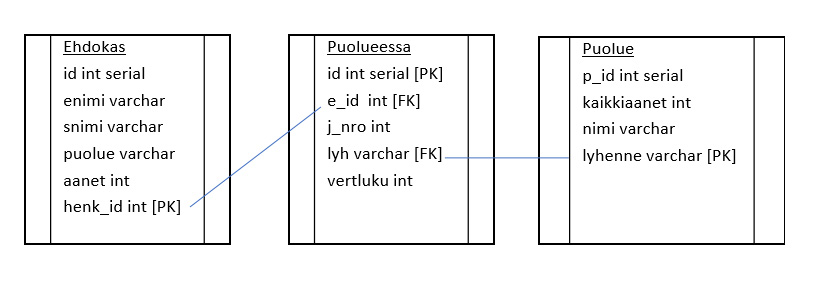

## Ohjelman käyttö

**Tietokanta**

Ohjelmassa käytetään paikallista Postgresql-tietokantaa, joka luodaan ennen ohjelman ajamista. Puolueiden nimet ja lyhenteet tallennetaan etukäteen tauluun puolue. 
Ohjelma tallentaa muut tiedot. 

	

**Tiedoston siirto**

Vaalit.txt tiedosto tallennetaan debug -kansioon ennen ohjelman ajamista. Jos tallennetaan muualle, niin muutetaan polku. 

**Pääohjelma ja kolme luokkaa**

Projekti sisältää pääohjelman ja kolme luokkaa: Program.cs, Db_tallennus.cs, Puolue.cs, Valitut.cs. 
Luokissa tehdään tietokantaoperaatioita ja tarkistuksen vuoksi myös tulostetaan tiedot.
 
**Program.cs**

Pääohjelma sisältää vain luokkien ilmentymien luomisen ja metodien kutsut. Kaikki toiminnot on kirjoitettu luokkien sisään.

**Db_tallennus**

Luokka Db_tallennus sisältää metodin Tallenna(), joka lukee tiedoston vaalit.txt sisällön  ja 
tallentaa sen kaikki tiedot ja ohjelmassa luodun henkilönumeron (henk_id) tietokannan tauluun Ehdokas ja 
tauluun Puolueessa henkilönumeron sekä puolueen lyhenteen. 
try-catch -toiminnolla estetään ohjelman kaatuminen, jos tietoja yritetään syöttää uudestaan.
 
**Puolue.cs**

Luokka Puolue sisältää kolme metodia. Metodi PuolueAanet() hakee tietokannasta äänimäärät puolueittain ja laskee ne yhteen. 
Kokonaisäänimäärät tallennetaan tauluun Puolue. Metodi palauttaa listan, johon on tallennettu äänimäärät puolueiden mukaisessa järjestyksessä. 
Metodi Jarjesta() järjestää ehdokkaat äänimäärän mukaiseen järjestykseen ja laskee vertailuluvun. 
Metodi TallennaJarjestys() tallentaa järjestysnumeron ja vertailuluvun tauluun Puolueessa.

**Valitut.cs**

Luokka Valitut sisältää kaksi metodia. Metodi TulostaValitut() hakee ehdokkaat tietokannasta vertailuluvun mukaisessa järjestyksessä ja tulostaa 51 ensimmäistä. 
Metodi TulostaPuolueittain() tulostaa valtuustoon valitut ehdokkaat puolueittain. 
